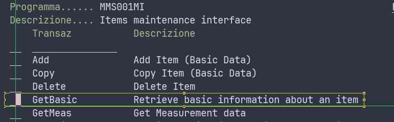
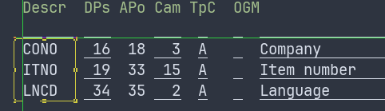
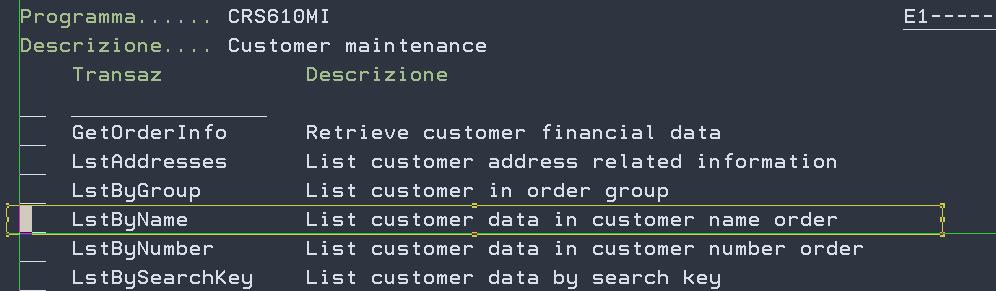
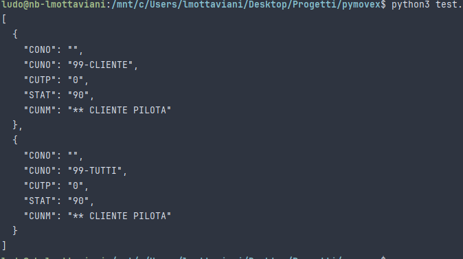

# PyMovex3

PyMovex3 is a Python 3 wrapper to communicate with an M3/Movex subsytem through a C library linked against the MvxSock
library and the Python SDK.

## Usage

Let's suppose we are trying to run a `GetBasic` instruction from our `MMS001MI` program in the `QFOOBAR` library.



First of all, we have to instantiate a connection to the MvxSock library:

```python
import pymovex

pymovex.connect("QFOOBAR/PPS001MI", host="127.0.0.1", port=6000, user="IBM", passwd="SERVICE")
```

We know that the procedure takes these input fields (the first two not allowing null values):



And returns a lot of output fields.

The `fquery` function allows us arbitrarily choose which input and/or output fields we are going to use.

The code
```python
try:
    pymovex.connect("QFOOBAR/MMS001MI", host="127.0.0.1", port=6000, user="IBM", passwd="SERVICE")
    res = pymovex.fquery_single(
        cmd="GetBasic",
        fieldMap={"CONO": "010", "ITNO": "PK1603F"},
        outputFields=("ITNO", "ITDS")
    )
    print(json.dumps(res))
except Exception as e:
    logging.error(e)
```
shows this:
```
╰─>$ python3 test.py
{"ITNO": "PK1603F", "ITDS": "ARMADIO P56,3 H257,6 L30"}
```

Now let's suppose we need to retrieve a list of customers through our `LstByName` transaction:



We declare a connection, set a list of maximum records in output (2 records) then proceed calling the `fquery` function.
The `fquery` function returns an OrderedList, therefore we iterate over the results. So, the following code

```python
try:
    pymovex.connect("QFOOBAR/CRS610MI", host="127.0.0.1", port=6000, user="IBM", passwd="SERVICE")
    pymovex.maxrec(2)

    res_query = pymovex.fquery("LstByName",
                               {"CONO": "010"},
                               ('CONO', 'CUNO', 'CUTP', 'STAT', 'CUNM'))
    res = []
    for r in res_query:
        res.append(r)
    print(json.dumps(res, indent=2))
except Exception as e:
    logging.error(e)
```

will produce this:



That's cool!

## Notes

This library, contrary to the original pymovex, assumes the text is ISO-8859-1 encoded and performs conversion at low
level. If your system is using another encoding, you'll have to search for "iso-8859-1" and replace it in the _pymovex.c
source file.

## Credits where credits are due

The library I ported was originally written by Jean-Baptiste Quenot in 2013: https://github.com/jbq/PyMovex/
